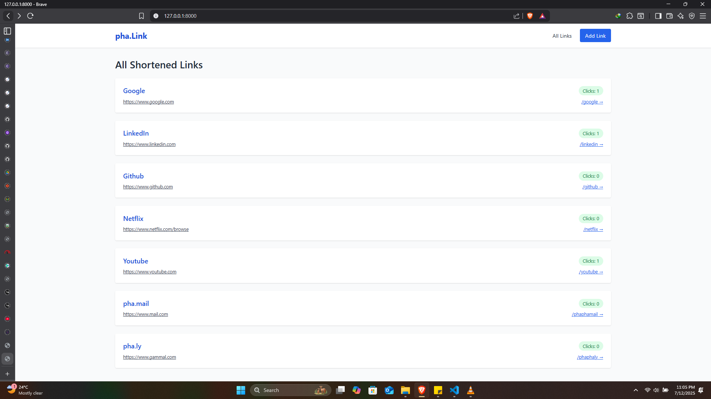
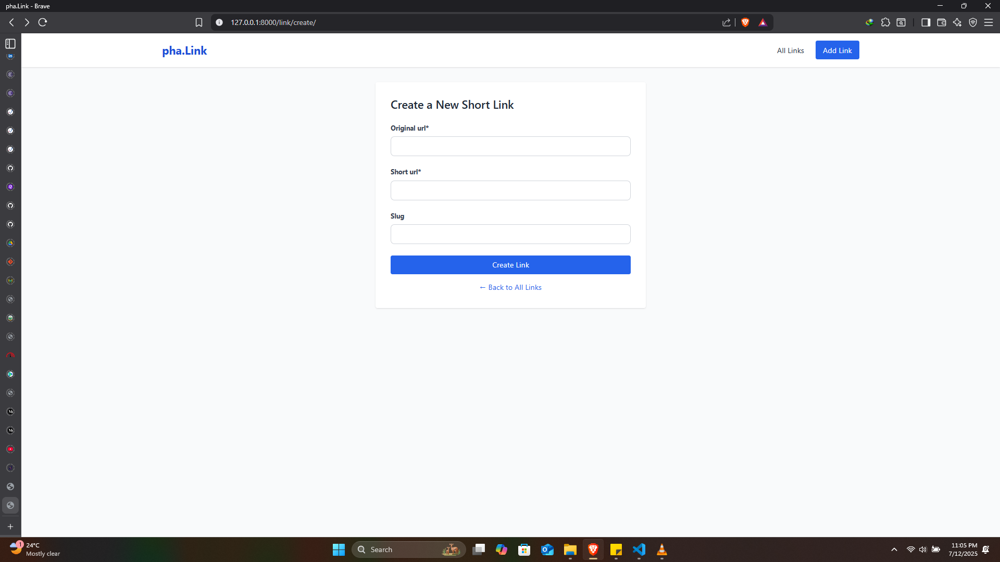

# 🔗 pha.Link - Django URL Shortener


A simple, clean Django-based URL shortener app where users can shorten long URLs, track clicks, and manage their links.

---

## 🚀 Features

- 🔒 Unique short URL generation
- 📈 Click tracking for each link
- 🕵️ View all created links
- 🎨 Beautiful TailwindCSS frontend
- 📆 Timestamped link creation

---

## 🛠️ Tech Stack

- 🐍 Django 5+
- 🌐 TailwindCSS (CDN)
- 💾 SQLite (default, but easily switchable)
- 🍰 Crispy Forms (for styling the forms)

---

## 📸 Screenshots




---

## 🧰 Installation

### 1. Clone the Repository

```bash
git clone https://github.com/phavour-EBEN/link_shortener.git
cd link_shortener
````

### 2. Set Up Virtual Environment

```bash
python -m venv venv
source venv/bin/activate  # Windows: venv\Scripts\activate
```

### 3. Install Dependencies

```bash
pip install -r requirements.txt
```

### 4. Run Migrations

```bash
python manage.py migrate
```

### 5. Run the Development Server

```bash
python manage.py runserver
```

Now visit: [http://127.0.0.1:8000](http://127.0.0.1:8000)

---

## ✍️ Usage

* Navigate to the **Add Link** page.
* Paste your long URL and submit.
* Get a unique shortened link (like `/abc123`)
* Share and track click stats easily.

---

## 🧪 Example

```
Original: https://www.google.com/search?q=django+url+shortener
Shortened: http://127.0.0.1:8000/django123
```

---

## 📁 Project Structure

```
link_shortener/
├── links/             # Core app
│   ├── templates/
│   ├── models.py
│   ├── views.py
│   ├── forms.py
├── templates/
│   ├── links/_base.html
│   ├── links/create_link.html
│   └── links/index.html
├── db.sqlite3
├── manage.py
```

---

## 🤝 Contributing

Pull requests are welcome! For major changes, open an issue first to discuss what you would like to change.

---

## 🙋‍♂️ Author

**Ebenezer Ainoo**
- [GitHub](https://github.com/Phvour-EBEN) 
-  [LinkedIn](https://linkedin.com/in/ebenezer-ainoo)

